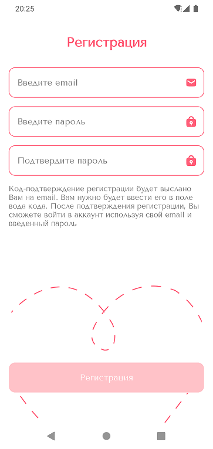

# Luvio - приложение для создания маршрутов свиданий 💖

Luvio — это приложение, помогающее создавать идеальные маршруты для свиданий. Для взаимодействия с сетью используется собственный бэк-энд.

## ✨ Реализованные фичи

| Фича          | Описание | Изображение |
|--------------|----------|------------|
| 🏁 **Onboarding** | Интерактивное введение в приложение |  |
| 🔐 **Login** | Авторизация пользователей |  |
| 📝 **Registration** | Регистрация новых пользователей |  |
| 🏡 **Home** | Главный экран с маршрутами (In progress...)|  |

## 🛠 Технологический стек

- **Kotlin** — основной язык разработки
- **Jetpack Compose** — современный UI-фреймворк
- **Jetpack Navigation, navigation-compose** — управление навигацией
- **Dagger 2** — внедрение зависимостей
- **Ktor** — работа с сетью
- **kotlinx-serialization-json** — сериализация данных
- **Coroutines, Flow** — асинхронная работа
- **Material** — UI-компоненты
- **MVVM** — архитектурный паттерн
- **Многомодульность** — модульная структура приложения
- **JUnit 5, MockK** — тестирование

## 🎨 Дизайн и дизайн-система
Весь дизайн приложения, включая дизайн-систему, разработан мною с учетом удобства и эстетики.

## 🏗 Архитектура проекта
В этом разделе будет изображение с архитектурой модулей и их взаимодействием.

---
